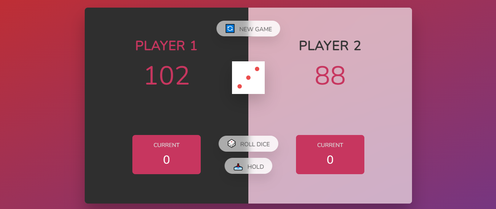
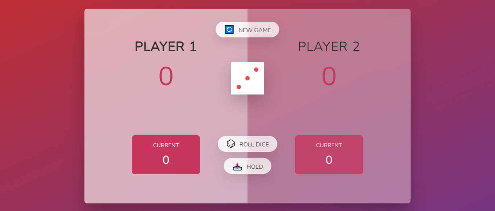

# Dice Game
## This Game Have New Experience!!


[Demo of Dice game](https://smsajjadsm.github.io/Dice-Game/)
===




## Features

- Different color theme for both dark and light mode
- Ability to save data in local storage
- Ability to save activities with date
- Ability to search activities
- The ability to change the information of each activity and save it again in local storage


## Installation


First clone project ...

```sh
https://github.com/SMsajjadSM/Todo-List.git
```

Install the dependencies and devDependencies

```sh
npm i
```


#### How to support?
 If you enjoyed and used this post,
I would appreciate it if you could
support me by giving me a ⭐

[SMsajjadSM](https://github.com/SMsajjadSM/Todo-List)
